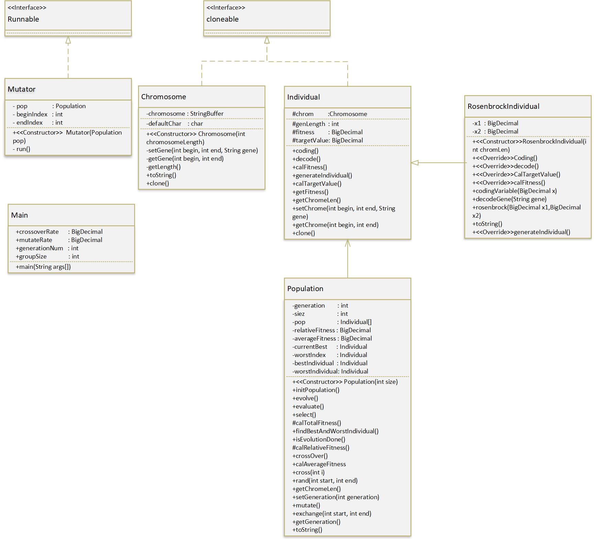

# Mock evolution using Genetic Algorithm made by Xu Han && Lin Xu
##  This project is aim to figure out how to find the target individual by using genetic algorithm as well as tracing every Generation's best chromosome and current chromosome, try to understand how the evolution in the real world work. By check function value we can find that the difference between best and current. 

##  Steps of the genetic Algorithm:
####    Initialization
####    Evolution
###       Selection
###       Crossover
###       Mutation
###       Evaluation

##  Difference from other normal genetic algorthms:
####   Using multithread during the mutating process
####   Use BigDecimal rather than double to maintain and scale the loss of the accurate

## UML diagram:

==================

#  To see all details please check: Report.docx or GAFinalreport.docx(same content) &#x1F34E;

